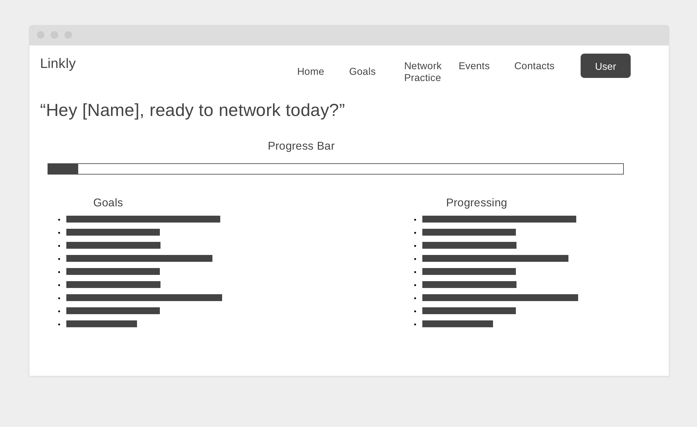
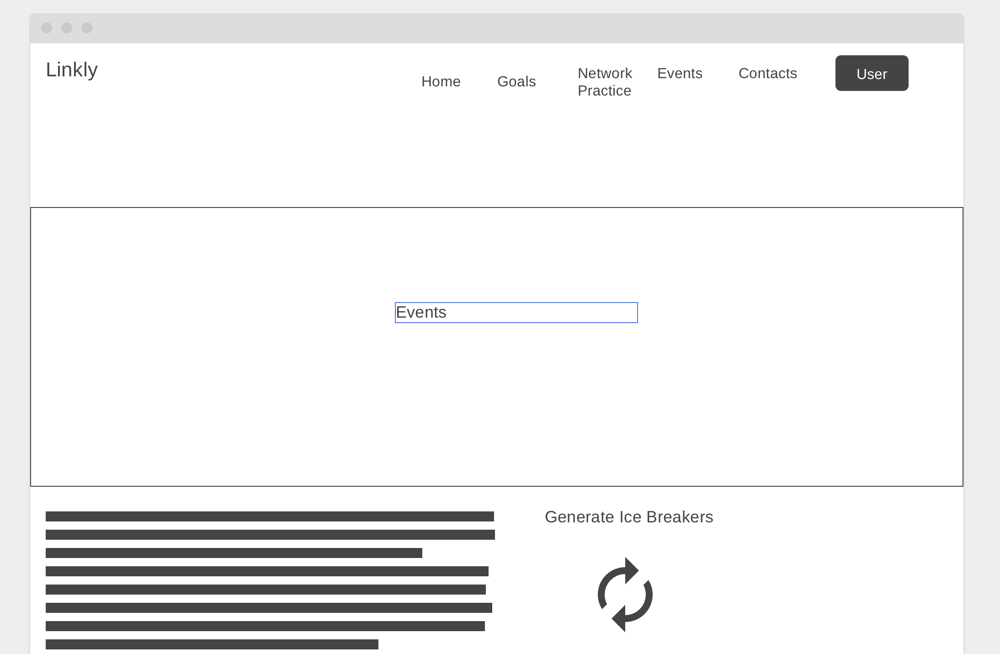

# Linkly: Your AI Networking Companion 🌐🤖

Linkly is an AI-powered networking companion designed to help users practice professional networking, refine their communication skills, and build confidence in real-world interactions. By simulating realistic conversations, Linkly provides constructive feedback and tips to help you improve your networking prowess—all in a cozy, supportive environment.

---

## 🚀 Features

### Current Features:

- **User Management**: Create, edit, and manage your personal profile within the app.
- **Events & Follow-ups**: Plan networking events and keep track of important follow-ups.
- **AI Chat Interface**: Chat with Linkly's AI to simulate professional networking conversations (coming soon).

### In Progress:

- **AI Feedback System**:  
  Linkly will analyze user inputs during chats, identify areas for improvement, and provide actionable suggestions to enhance communication skills.

### Future Enhancements:

- Real-time goal tracking for networking skills.
- Integration with external APIs for LinkedIn profile suggestions.
- Gamification features to keep networking practice engaging.

---

## 📖 How Linkly Works

Linkly is designed to function as a virtual mentor for networking practice. Here’s what to expect when fully implemented:

1. **Chat with the AI**:  
   Engage in realistic networking scenarios, such as introducing yourself, following up with a potential mentor, or negotiating opportunities.

2. **Constructive Feedback**:  
   After each conversation, the AI will:

   - Highlight effective communication techniques used during the chat.
   - Suggest areas for improvement.
   - Provide alternative phrasing or tips for better networking outcomes.

3. **Networking Practice**:  
   Users can rehearse common scenarios, like explaining their career goals, requesting informational interviews, or delivering an elevator pitch.

---

## 🎨 Wireframes

### **Home Page**



### **Chat Page**


### **Event Manager**



### **Goals Manager**


### **Contact Manager**


---

## ⚠️ Project Status: Work in Progress 🚧

Linkly is still in development, and I’m actively building out its core features, including the AI chat functionality. The current iteration focuses on setting up the foundational CRUD operations and structuring the user flow for an intuitive experience.

### What’s Next?

- **AI Development**:  
  The AI-powered chat feature is being designed to provide human-like conversational feedback using advanced natural language processing APIs.

  - Initial models will utilize external AI APIs (e.g., OpenAI GPT-4).
  - Future iterations will incorporate a custom AI model tailored for networking practices.

- **Feedback Mechanism**:  
  A key goal is to implement an interactive scoring and suggestion system that evaluates conversation quality in real time.

---

## 📚 Tech Stack

- **Frontend**: EJS, CSS
- **Backend**: Node.js, Express.js
- **Database**: MongoDB
- **AI API**: (e.g., OpenAI GPT-4)

---

## 🛠️ Getting Started

1. Clone this repository:
   ```bash
   git clone https://github.com/yourusername/linkly.git
   ```
